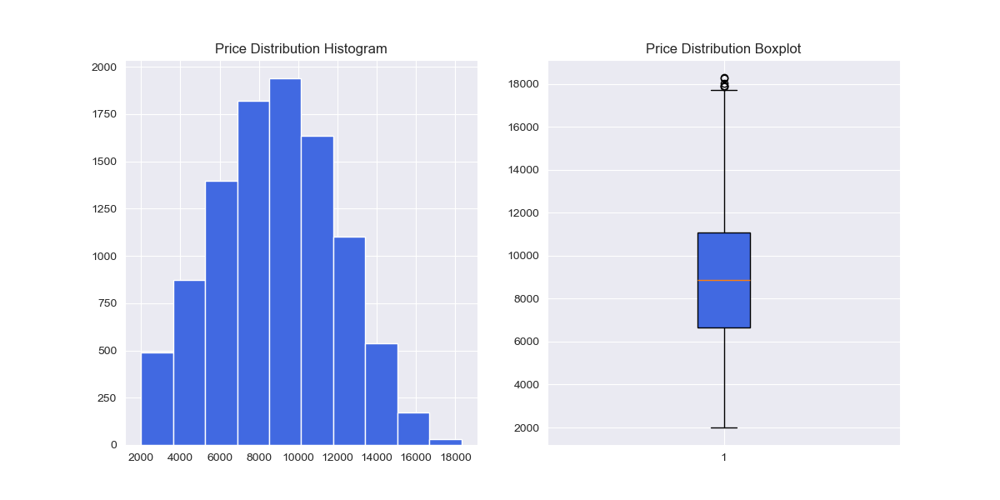
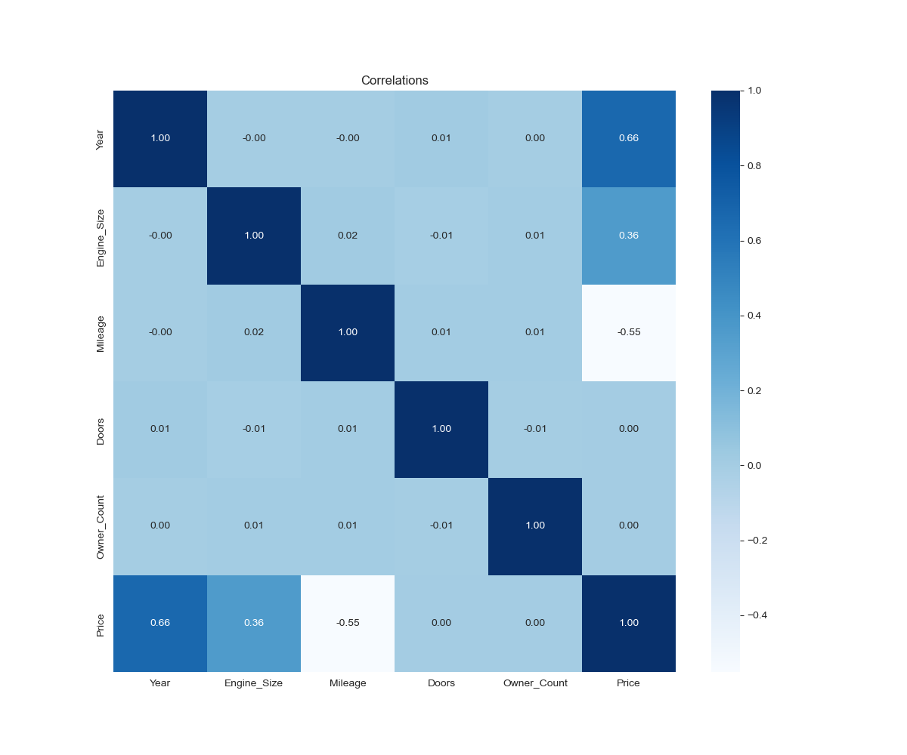
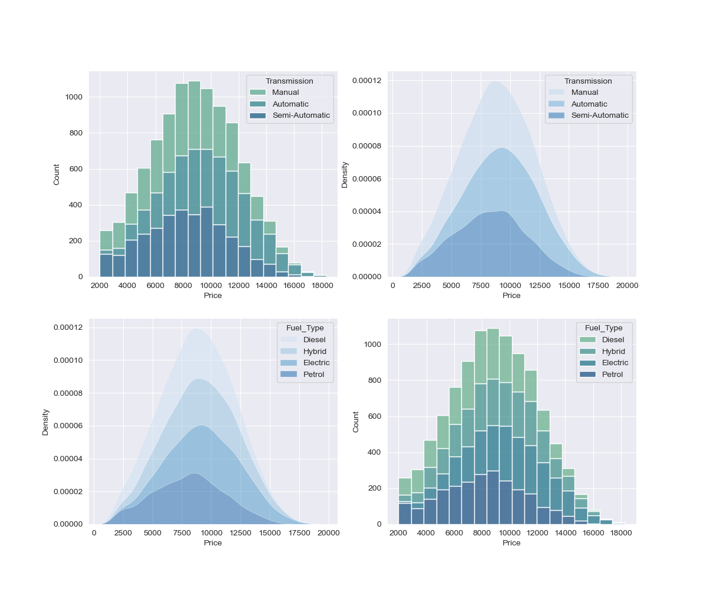
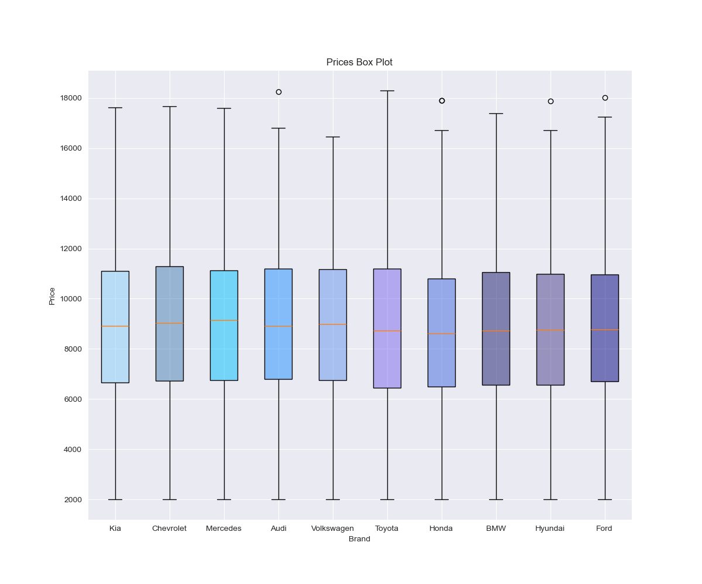
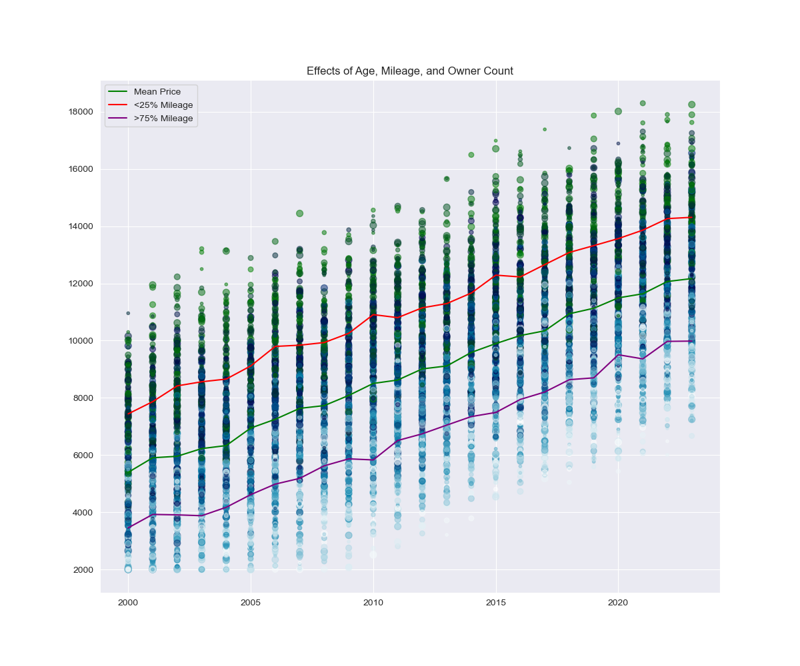
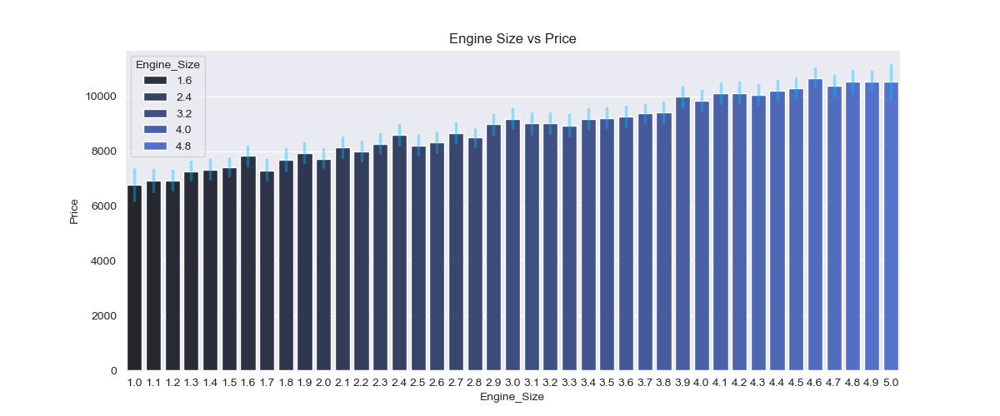
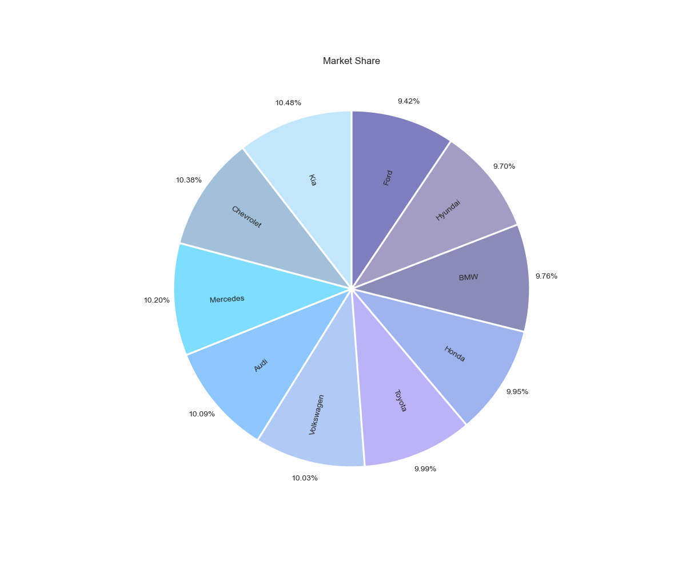
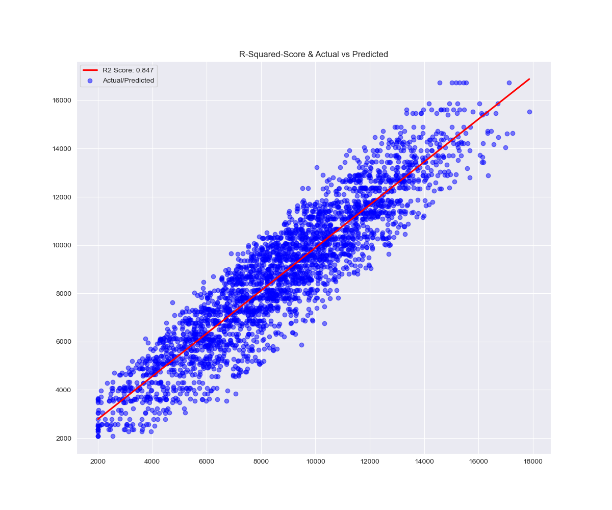
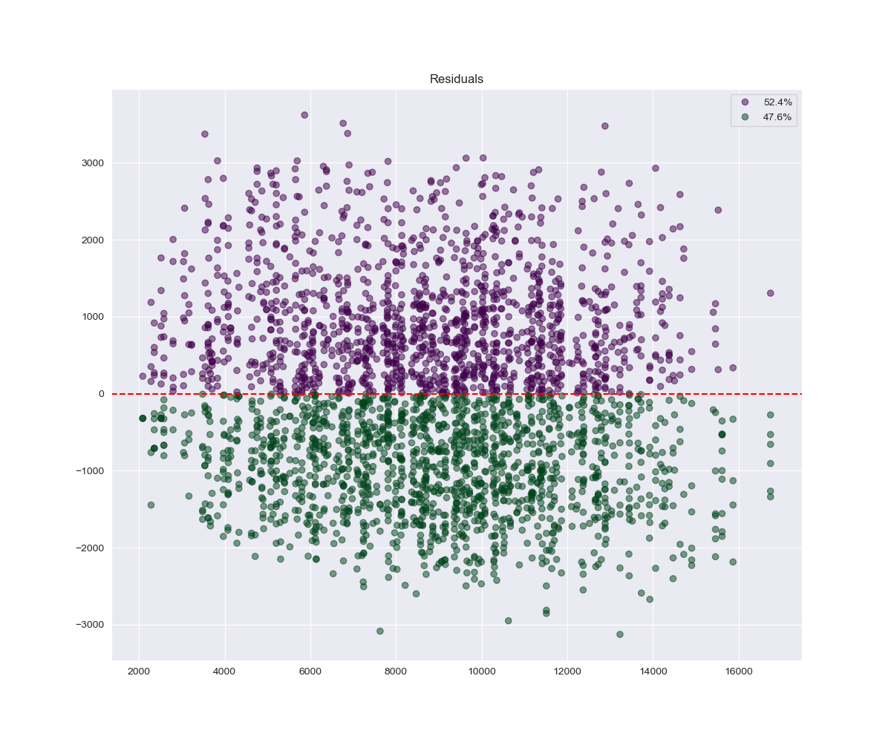
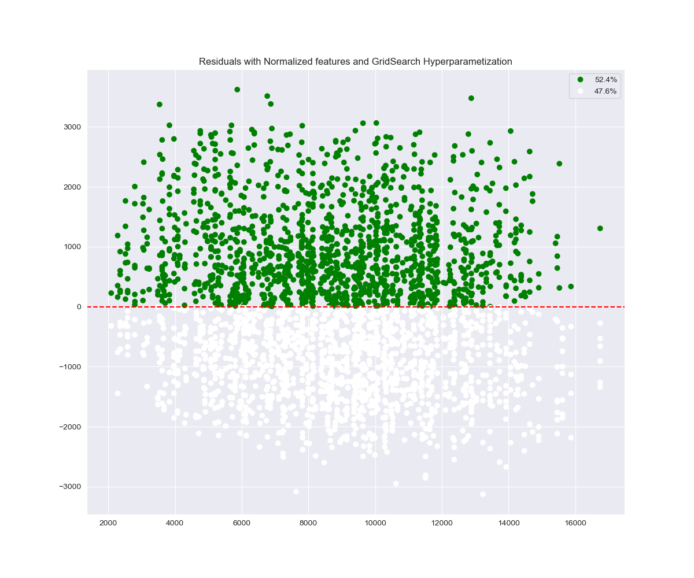

<h1 align="center">Analysis of Car Prices Over 2000-2024</h1>
<h3 align="left">Overview</h3>
<p>If you have ever wondered what are the specifications and brand of a comfortable, stylish, and at the same time an affordable car, you do not need to look any further. In this project I will cover car ranging from $2,000 to $18,000 dollars</p>
<h3>Table of contents</h3>
<ul>
  <li>Installation</li>
  <li>Dependencies</li>
  <li>Dataset</li>
  <li>Results</li>
  <li>Machine Learning</li>
</ul>
<h3>Installation</h3>
<p>To run the project, clone this repository and install the necessary dependencies using pip.</p>

<ol>
  <li>Clone the Repository:</li>
<p>

```console
git clone https://github.com/EmilianoDeLaGarzaVillarreal/CarPriceAnalysis.git
cd CarPriceAnalysis
```

</p>
<li>Clone the Repository:</li>
<p>

```console
python -m venv venv
source venv/bin/activate  # On Windows, use `venv\Scripts\activate`
```

</p>
<li>Clone the Repository:</li>
<p>

```console
pip install -r requirements.txt
```

</p>
</ol>
<h3>Dependencies</h3>
<p>The project uses the following libraries:</p>
<ul>
  <li>Installation</li>
  <li>pandas - Data manipulation and analysis</li>
  <li>numpy - Numerical computing</li>
  <li>matplotlib and seaborn - Data visualization</li>
  <li>jupyter - For Jupyter Notebooks</li>
</ul>
<p>To install all the dependencies, run:</p>

```console
pip install -r requirements.txt
```
<h3>Dataset</h3>
<p>Dataset can be obtained from by running the following command on you systems bash:</p>

```console
curl -L -o ~/Downloads/car-price-dataset.zip\https://www.kaggle.com/api/v1/datasets/download/asinow/car-price-dataset</p>
``` 
 
<p>Or by visiting https://www.kaggle.com/datasets/asinow/car-price-dataset and downloading the zip file</p>

<h3>Results</h3>


<h4>It seems like there is a slight shift towards the left (cheaper prices) in the histogram, while boxplot shows a few outliers in the high-end of car prices, which makes sense since there is a base production price for a car but there is no real limit on how expensive a car can be.⚡</h4>


<h4>It appears that there are some normal and inverse relationships in the dataset➕➖, with the year of manufacturing being the most impactful.</h4>


<h4>There are some interesting finds in here!</h4>
<h5>The graphs at the top show how there is a greater quantity of manual and semi-automatic cars in the lower end of the price spectrum, while on the higher end automatic cars start to become more common, to the point that there is more automatic cars than both manual and semi-automatic</h5>
<h5>A similar behaviour appears in the bottom charts, with electrical cars being less common in the lower end of the price spectrum than on the higher end.</h5>
<h5>Interestingly there appears to be a balance in the middle point of the price values where all types of cars appear to be available.</h5>


<h4>The graph above is a more detailed view of the first boxplot of price distribution. Now the Prices are grouped by Brand, and we can see that all brands have the same base price for cars but Toyota has the highest ceiling.</h4>


<h4>There is 4 different graphs with a lot of information in the scatter/line plot above.🔎</h4>
<h5>I will explain the main characteristics of the graph.</h5>
<h5>The color in the scatter plot represents mileage, higher mileage is closer to blue color, while lower mileage is closer to green color. This demonstrates the inverse relationship between price and mileage.⤵️</h5>
<h5>Then we have size of each point in the scatter plot showing number of owners for a car, we can see that there is no relationship with price, and this supports our heatmap from the start of the exposition.✖️</h5>
<h5>The most important piece of information here is the x-axis vs the y-axis, or year manufactured vs price. There is little relationship between price and year for cars are that are >15 years old, but for cars newer than that there is a strong relationship between price and year.⤴️</h5>
<h5>Finally the three line plotted in the graph represent the mean price for all the cars in a given year (green), the mean price for all the cars in a given year with a mileage in the bottom 25% quantile (purple), and the mean price for all the cars in a given year with a mileage greater than the bottom 75% quantile (red). This lines help represent the inverse relationship between mileage and price.⤵️</h5>


<h4>The above bar graph follows an upward trend, where an increase in engine size tends to lead to an increase of price⤴️<h4>


<h4>The pie chart represents the market share for the car manufacturers. Kia is in the first place at 10.48%, while the lowest is Ford at 9.42% market share</h4>

<h2>Machine Learning Model</h2>

```python
features = ["Year", "Engine_Size", "Mileage"]
norm_features = ["Norm_Year", "Norm_Eng", "Norm_Mileage"]
target = ["Price"]
```
<p>I will use both normalized and original features to build two different models and see the differences in metric scores.</p>

```python
X_train, X_test, y_train, y_test = train_test_split(df[features], df[target].values.ravel(), test_size=0.3, random_state=1)
```

<p>This functions divides the dataset into training data and testing data.</p>

```python
min_MSE = 0
max_Rsq = 0
save = 0
for i in range(10):
    model = DecisionTreeRegressor(min_samples_leaf=5+i, random_state=1)
    model.fit(X_train,y_train)
    y_predict = model.predict(X_test)
    MSE = mean_squared_error(y_test, y_predict)
    Rsq = r2_score(y_test, y_predict)
    residuals = y_test - y_predict
    if i == 0 or (MSE < min_MSE and Rsq > max_Rsq):
        save = model
        min_MSE = MSE
        max_Rsq = Rsq
y_predict = save.predict(X_test)
MSE = mean_squared_error(y_test, y_predict)
Rsq = r2_score(y_test, y_predict)
residuals = y_test - y_predict
(MSE, Rsq, save)
```

<p>After a lot of testing I found out that 'min_samples_leaf' seemed to be the only hyperparameter that had a significant impact on the model. This is the way I came up with to find the best value for 'min_samples_leaf'.</p>

```console
(np.float64(1402953.690475489),
 0.850308174356166,
 DecisionTreeRegressor(min_samples_leaf=14, random_state=1))
```
<p>This is the output of the above cells.</p>

```python
plt.close()
fig, ax = plt.subplots(figsize=(12,10))

line1 = sns.regplot(x=y_test, y=y_predict, line_kws={'color':'red'}, label='R2 Score: ' + str(round(Rsq,3)), scatter=False, ci=None)
ax.scatter(y_test, y_predict, alpha=0.5, c='blue', label='Actual/Predicted')

ax.legend()
ax.set_title('R-Squared-Score & Actual vs Predicted')
plt.savefig('img/ML-scatter-one')
plt.show()
```
<p>This is the code to generate the below plot. In this visual I want to see how the R-squared score related to the dataset.</p>


<h4>The scatter plot represents the actual price vs the predicted price, the closer it is to a straight line the better, and it appears that our prediction are pretty good.</h4>
<h4>The red line in the graph is the regression line of our prediction equation.</h4>

```python
plt.close()
fig, ax = plt.subplots(figsize=(12,10))

colors = np.where(residuals<0, 1, -1)
values_under_zero = np.where(residuals<0, 1, 0).sum().item()
perc_vals = round((values_under_zero/len(residuals))*100,1)

scatter = ax.scatter(y_predict, residuals, c=colors, cmap='PRGn', alpha=0.5)

hand, lab = scatter.legend_elements(prop='colors')
ax.axhline(y=0.0, color='red', linestyle='--')
ax.legend(handles=hand, labels=[str(perc_vals)+'%',str(100-perc_vals)+'%'])
ax.set_title('Residuals')
plt.savefig('img/ML-scatter-two')

plt.show()
```
<p>I wanted to try and gather more information from the residuals and it seems like out model is making a good job at providing a mean guess for the car prices.</p>


<h4>In this scatter plot graph we are looking at the residuals, the errors from our predictions. The closer they get to the red dashed line the better</h4>
<h4>Also, it seems like the proportion of values above and below the red line are almost equal, this can be interpreted as our model making good predictions and ignoring the noise in the dataset.</h4>

<p>Finally, I re-trained the model to try and find how the normalized values affect the model predictions.</p>

```python
X_train, X_test, y_train, y_test = train_test_split(df[features], df[target].values.ravel(), test_size=0.3,  random_state=1)
parameters = {'min_samples_leaf' : [15,16,17,18,19,20]
              }
model = DecisionTreeRegressor()
grid = GridSearchCV(estimator=model, param_grid=parameters, cv=5)
grid.fit(X_train, y_train)
```

<p>I was also curious about the value that 'GridSearchCV' would give me for my model, so I implemented it too.</p>

```python
(grid.best_score_, grid.best_params_)
```

```console
(np.float64(0.8450033631305202), {'min_samples_leaf': 17})
```

<p>It seems this method got that 'min_samples_leaf' should be 17, let's see how it compares to 14, the value that I got before.</p>

```python
y_predict = grid.predict(X_test)
MSE = mean_squared_error(y_test, y_predict)
Rsq = r2_score(y_test, y_predict)
residuals = y_test - y_predict
(MSE, Rsq, grid.best_params_)
```

```console
(np.float64(1431408.4125552534), 0.8472721231128322, {'min_samples_leaf': 17})
```

<p>At least for the metrics that I am using it seems that 17 'min_samples_leaf' performs slightly worse. I will check it with a visual to see more closely how much it affects it.</p>

```python
plt.close()
fig, ax = plt.subplots(figsize=(12,10))

colors = np.where(residuals<0, 1, -1)
values_under_zero = np.where(residuals<0, 1, 0).sum().item()
perc_vals = round((values_under_zero/len(residuals))*100,1)

scatter = ax.scatter(y_predict, residuals, c=colors, cmap='PRGn', alpha=0.5)

hand, lab = scatter.legend_elements(prop='colors')
ax.legend(handles=hand, labels=[str(perc_vals)+'%',str(100-perc_vals)+'%'])
ax.axhline(y=0.0, color='red', linestyle='--')
ax.set_title('Residuals with Normalized features and GridSearch hyperparameterization')
plt.savefig('img/ML-scatter-three')

plt.show()
```


<h4>The values are less evenly distributed when compared to the chart above. After some testing, I discovered it is because the scoring values that GridSearch bases its results on was giving me a slightly less optimal hyperparameter than the one I had chose. In regards with the normalized values, they perform very slightly better, but not significantly.</h4>

<h3>Improvement to the model are possible, with things such as models using the categorical features to help perform a prediction, although this runs into the problem of over-fitting, and therefore, I believe that my choice of using a model with little flexibility and few features is a correct one, this is due to the characteristics of the Dataset.</h3>


