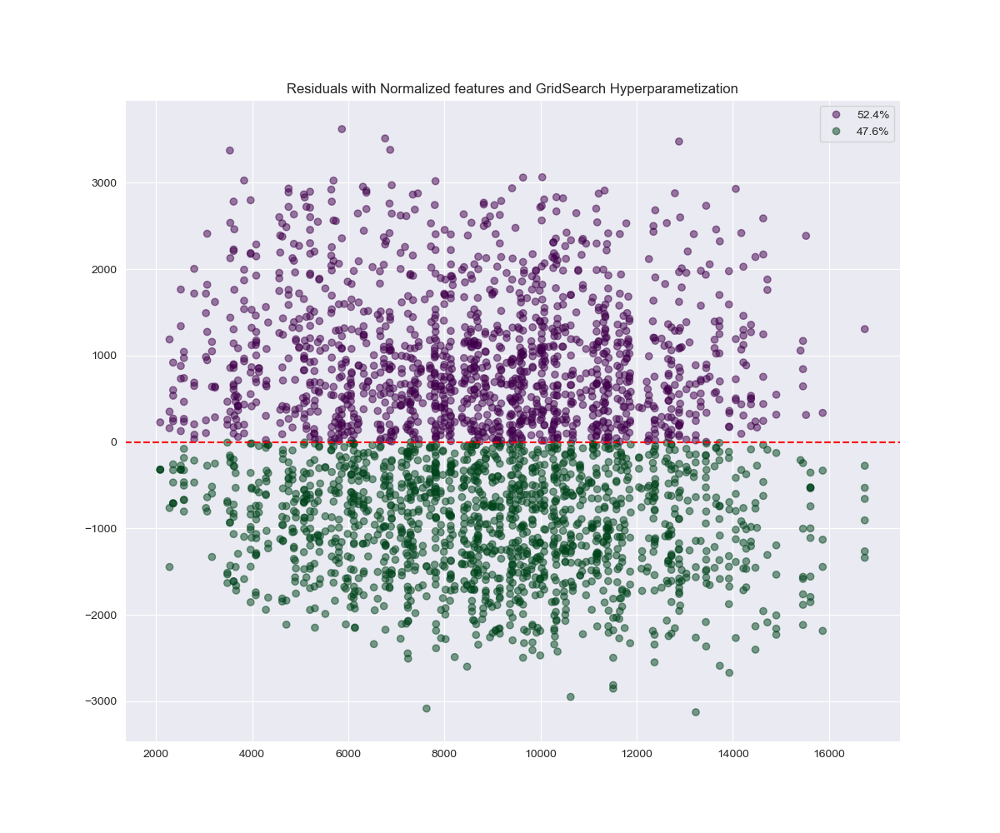

<h1 align="center">Analysis of Car Prices Over 2000-2024</h1>
<h3 align="left">Overview</h3>
<p>If you have ever wondered what are the specifications and brand of a comfortable, stylish, and at the same time an affordable car, you do not need to look any further. In this project I will cover car ranging from $2,000 to $18,000 dollars</p>
<h3>Table of contents</h3>
<ul>
  <li>Installation</li>
  <li>Dependencies</li>
  <li>Dataset</li>
  <li>Results</li>
</ul>
<h3>Installation</h3>
<p>To run the project, clone this repository and install the necessary dependencies using pip.</p>

<ol>
  <li>Clone the Repository:</li>
<p>

```console
git clone https://github.com/EmilianoDeLaGarzaVillarreal/CarPriceAnalysis.git
cd CarPriceAnalysis
```

</p>
<li>Clone the Repository:</li>
<p>

```console
python -m venv venv
source venv/bin/activate  # On Windows, use `venv\Scripts\activate`
```

</p>
<li>Clone the Repository:</li>
<p>

```console
pip install -r requirements.txt
```

</p>
</ol>
<h3>Dependencies</h3>
<p>The project uses the following libraries:</p>
<ul>
  <li>Installation</li>
  <li>pandas - Data manipulation and analysis</li>
  <li>numpy - Numerical computing</li>
  <li>matplotlib and seaborn - Data visualization</li>
  <li>jupyter - For Jupyter Notebooks</li>
</ul>
<p>To install all the dependencies, run:</p>

```console
pip install -r requirements.txt
```
<h3>Dataset</h3>
<p>Dataset can be obtained from by running the following command on you systems bash:</p>

```console
curl -L -o ~/Downloads/car-price-dataset.zip\https://www.kaggle.com/api/v1/datasets/download/asinow/car-price-dataset</p>
``` 
 
<p>Or by visiting https://www.kaggle.com/datasets/asinow/car-price-dataset and downloading the zip file</p>

<h3>Results</h3>





